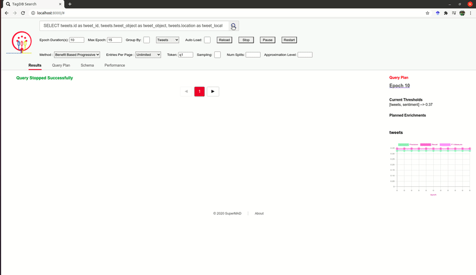

# EnrichDB: A Database System for Progressive Data Enrichmentand Query Evaluation 

Full version of the paper is as follows:
https://github.com/DB-repo/enrichdb/blob/master/EnrichDB_Technical_Report.pdf


### Installlation Using Docker (tested on Ubuntu 16.04, 18.04, and 20.04)

```
git clone <enrichdb git repo link>
sudo docker build -t enrichdb enrichdb/
sudo docker run --net=host --name enrichdb_con enrichdb
```

Connect to  postgresql running tagdb inside docker 
```
sudo docker exec -it enrichdb_con bash
su - postgres 
/usr/local/pgsql/bin/psql test
```
Run UI to execute and visualize queries

```
cd enrichdb/ui
python server.py  # requires python2

UI is accessible at localhost:8000
```
** EnrichDB code is based on Apache MadLib

### Example Query Execution Using EnrichDB UI
Copy-paste the following query in search box.
```
SELECT tweets.id as tweet_id, tweets.tweet_object as tweet_object, tweets.location as tweet_location, 
tweets.timestamp as tweet_time, tweets.sentiment as tweet_sentiment @FROM tweets 
@WHERE  tweets.sentiment = 0 AND tweets.id < 700
```
In the UI, set the following values in the corresponding boxes. 
Set epoch_duration = 5, max_epoch = 10, select "Tweets" from the drop-down menu, check the auto-reload box, and provide a value in the token that was not used before (e.g., q1). Click on the search button next to the search box. Once submitted, the interface will show that "Query submitted successfully". 



